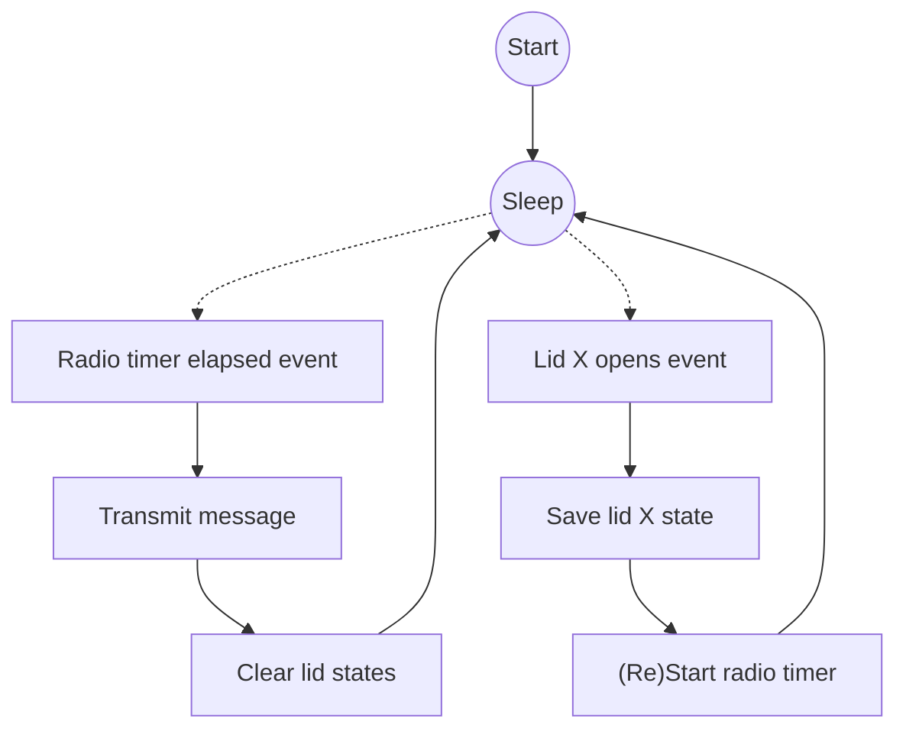

```mermaid
graph TD
Start((Start));
StartRadioTimer["(Re)Start radio timer"];
TransmitMessage[Transmit message];
RadioTimerElapsed[Radio timer elapsed event];
ClearLidState[Clear lid states];
LidOpenEvent[Lid X opens event];
SaveLidState[Save lid X state];

Start --> Sleep;
RadioTimerElapsed --> TransmitMessage;
Sleep -.-> RadioTimerElapsed;
Sleep -.-> LidOpenEvent;
TransmitMessage --> ClearLidState;
ClearLidState --> Sleep;
LidOpenEvent --> SaveLidState;
SaveLidState --> StartRadioTimer;
StartRadioTimer --> Sleep;
Sleep((Sleep));
```